Visualization
================
Zorbey Özcan
2024-04-22

# Introduction

In the following code I will generate plots to explore my data. I do
this to find interesting insights that might need further analysis and
interpretation. I hope to find and visualize patterns and find
explanations for them.

``` r
# Packages 
suppressWarnings({
library(ggplot2)
library(tidyverse)
library(dplyr)
library(lubridate)
library(readr)
library(git2r)
})
```

    ## ── Attaching core tidyverse packages ──────────────────────── tidyverse 2.0.0 ──
    ## ✔ dplyr     1.1.4     ✔ readr     2.1.5
    ## ✔ forcats   1.0.0     ✔ stringr   1.5.1
    ## ✔ lubridate 1.9.3     ✔ tibble    3.2.1
    ## ✔ purrr     1.0.2     ✔ tidyr     1.3.1
    ## ── Conflicts ────────────────────────────────────────── tidyverse_conflicts() ──
    ## ✖ dplyr::filter() masks stats::filter()
    ## ✖ dplyr::lag()    masks stats::lag()
    ## ℹ Use the conflicted package (<http://conflicted.r-lib.org/>) to force all conflicts to become errors
    ## 
    ## Attaching package: 'git2r'
    ## 
    ## 
    ## The following object is masked from 'package:dplyr':
    ## 
    ##     pull
    ## 
    ## 
    ## The following objects are masked from 'package:purrr':
    ## 
    ##     is_empty, when

# Exploring my data - Step Count

## Oversight

In this first plot, I hope to give myself (and anyone who reads this)
general oversight over my step data. So here is a plot, showing all of
my steps over the whole time lapse of this data set.

``` r
# Loading the data 
StepCount_by_day <- readRDS("/Users/zorbeyozcan/Desktop/apple_health/Apple_health_data/rds_filesStepCount_by_day.rds")

# Calculating the average of total steps
average_steps <- mean(StepCount_by_day$StepCountDaily)

# Plotting the data 
ggplot(StepCount_by_day, aes(date, StepCountDaily)) + 
      geom_point(size = 0.5 ) +
  
      geom_hline(yintercept = average_steps, linetype = "dashed", color = "red") +
  
      scale_y_log10() + 
  
      theme(plot.margin = unit(c(1,1,1,1), "cm") ) +
  
      labs(x = "Date", y = "Steps on log scale ", title = "Daily Steps & Average Total Steps")
```

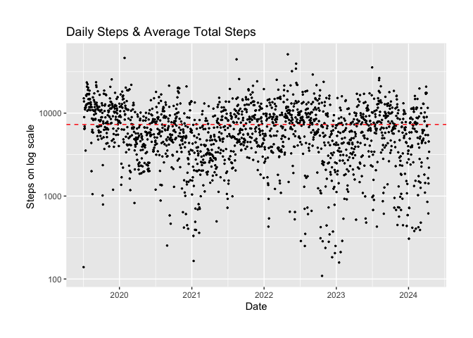<!-- -->

### Oversight interpreted

In this plot, so many cases are displayed, that it is hard to interpret.
No pattern is clearly visible. The plot is drastically OVERPLOTTED.

Let’s apply some techniques and try to split the data up.

Only one thing can be said: an average of 7000 steps is not optimal,
let’s try to find out how I can improve this.

## Average by year

To gather more insight, let’s see how many steps on average I took each
year. I will leave 2024 out, because the data contains values only up to
April. I will leave 2019 in, to compare pre- and post Covid values.

``` r
# Calculatiing the average of total steps for each year. 
avg_step_by_year <- StepCount_by_day %>%
  group_by(year) %>%
  summarise(avg_steps_y = mean(StepCountDaily))

# Plotting
ggplot(avg_step_by_year, aes(year, avg_steps_y, fill = year)) + 
  geom_bar(stat= "identity" , position = position_dodge(), show.legend = FALSE) + 
  labs( x = "" , y = " average steps", title = "Average Daily Steps by Year")
```

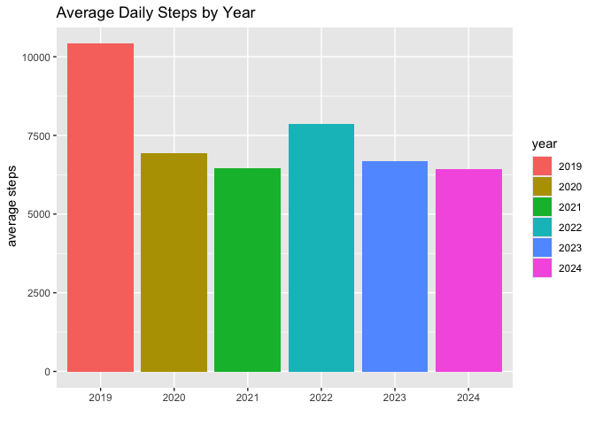<!-- -->

### Average by year interpreted

It seems like my average step count shows no clear trend. Although I
endured Covid lock downs in the years of 2020 and 2021, as many of us
did, there is no significant difference to the years after. In 2022 it
seems like I wanted to make up for the years in lock down, but I did not
continue this trend in 2023. I myself cannot explain the huge spike in
2019. Maybe the summer months weigh extra heavy in this calculation,
which brings me to my next idea.

## Steps by season

Here I will divide the data into seasons and look at the average steps
per season in each year.

I divided the seasons into:

Spring: March - May Summer: June - August Autumn: September - November
Winter: December - February

``` r
# Mutating the months into seasons
step_by_season <- StepCount_by_day %>% 
  mutate( season = case_when(
    month %in% 3:5   ~ "Spring",
    month %in% 6:8   ~ "Summer",
    month %in% 9:11  ~ "Fall",
    month %in% c(12, 1, 2) ~ "Winter",
    TRUE ~ NA_character_
  ))

# calculating the average
avg_step_by_season <- step_by_season %>%
  group_by(year, season) %>%
  summarise(average_steps = mean(StepCountDaily, na.rm = TRUE), .groups = 'drop') %>%
  filter(year != 2024) %>%
  mutate(year_season = interaction(year, season, sep = " "),
         year_season = factor(year_season, levels = c("2019 Spring", "2019 Summer", "2019 Fall", "2019 Winter",
                                                      "2020 Spring", "2020 Summer", "2020 Fall", "2020 Winter",
                                                      "2021 Spring", "2021 Summer", "2021 Fall", "2021 Winter",
                                                      "2022 Spring", "2022 Summer", "2022 Fall", "2022 Winter",
                                                      "2023 Spring", "2023 Summer", "2023 Fall", "2023 Winter")))

# Plotting 
ggplot(avg_step_by_season, aes( year_season, average_steps, fill = year)) +
  
  geom_bar(stat = "identity", position = "dodge", show.legend = FALSE) +
  
  labs(x = "Year and Season", y = "Average Daily Steps", title = "Average Daily Steps by Season and Year") +
  
  theme_classic() +
  
  theme(axis.text.x = element_text(angle = 45, hjust = 1))
```

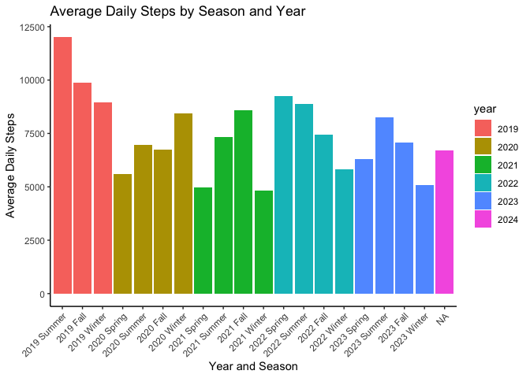<!-- -->

### Steps by season interpreted

Now this makes a lot more sense. You can clearly see more activity in
the spring and summer season, especially after the Covid lockdowns.
Berlin is very nice during the summer season so I like to be outside a
lot more. Let’s dive deeper. I will mark holidays, which are usually
spend outside to see if they correlate with a higher step count.

The holidays are: New years eve, May 1st (a huge holiday here in Berlin)
and December 7th (my birthday).

## Steps by year

``` r
# Creating a data frame for every year 

StepCount_2023 <- StepCount_by_day %>% 
  filter(year(date) == 2023)

StepCount_2022 <- StepCount_by_day %>% 
  filter(year(date) == 2022)

StepCount_2021 <- StepCount_by_day %>% 
  filter(year(date) == 2021)

StepCount_2020 <- StepCount_by_day %>% 
  filter(year(date) == 2020)

StepCount_2019 <- StepCount_by_day %>% 
  filter(year(date) == 2019)

# Adding the holidays for every year
holidays_2019 <- as.Date(c("2019-01-01", "2019-05-01", "2019-12-07"))
holidays_2020 <- as.Date(c("2020-01-01", "2020-05-01", "2020-12-07"))
holidays_2021 <- as.Date(c("2021-01-01", "2021-05-01", "2021-12-07"))
holidays_2022 <- as.Date(c("2022-01-01", "2022-05-01", "2022-12-07"))
holidays_2023 <- as.Date(c("2023-01-01", "2023-05-01", "2023-12-07"))

# Plotting each year 

# 2023
ggplot(StepCount_2023, aes(date, StepCountDaily)) + 
  geom_vline(xintercept = as.numeric(holidays_2023), color = "red", linetype = "dashed", size = 0.5) +
  geom_point(alpha = 0.5, size = 0.5) +
  labs(title = "Daily Steps in 2023", x = "", y = "Steps")
```

    ## Warning: Using `size` aesthetic for lines was deprecated in ggplot2 3.4.0.
    ## ℹ Please use `linewidth` instead.
    ## This warning is displayed once every 8 hours.
    ## Call `lifecycle::last_lifecycle_warnings()` to see where this warning was
    ## generated.

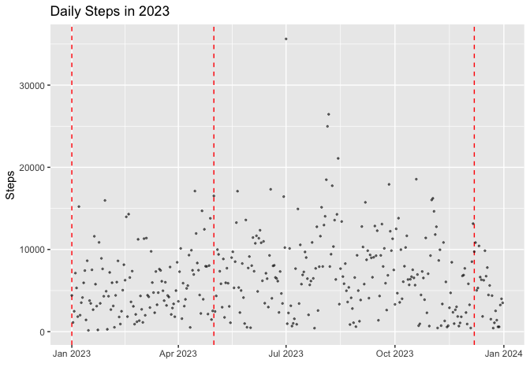<!-- -->

``` r
# 2022
ggplot(StepCount_2022, aes(date, StepCountDaily)) + 
  geom_vline(xintercept = as.numeric(holidays_2022), color = "red", linetype = "dashed", size = 0.5) +
  geom_point(alpha = 0.5, size = 0.5) +
  labs(title = "Daily Steps in 2022", x = "", y = "Steps")
```

<!-- -->

``` r
# 2021
ggplot(StepCount_2021, aes(date, StepCountDaily)) + 
  geom_vline(xintercept = as.numeric(holidays_2021), color = "red", linetype = "dashed", size = 0.5) +
  geom_point(alpha = 0.5, size = 0.5) +
  labs(title = "Daily Steps in 2021", x = "", y = "Steps")
```

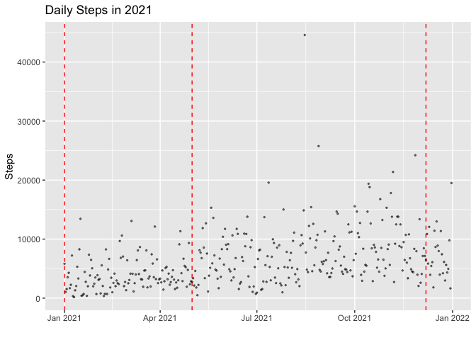<!-- -->

``` r
# 2020
ggplot(StepCount_2020, aes(date, StepCountDaily)) + 
  geom_vline(xintercept = as.numeric(holidays_2020), color = "red", linetype = "dashed", size = 0.5) +
  geom_point(alpha = 0.5, size = 0.5) +
  labs(title = "Daily Steps in 2020", x = "", y = "Steps")
```

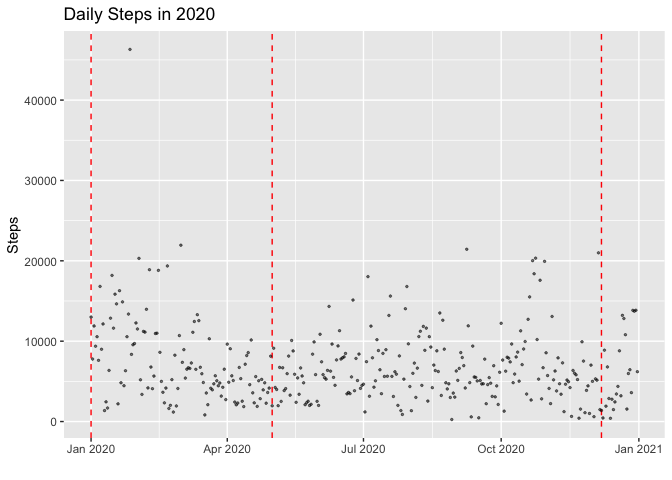<!-- -->

``` r
# 2019
ggplot(StepCount_2019, aes(date, StepCountDaily)) + 
  geom_vline(xintercept = as.numeric(holidays_2019), color = "red", linetype = "dashed", size = 0.5) +
  geom_point(alpha = 0.5, size = 0.5) +
  labs(title = "Daily Steps in 2019", x = "", y = "Steps")
```

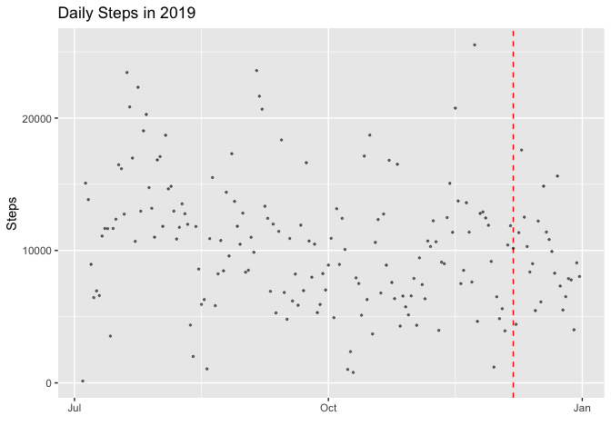<!-- -->

### Steps by year interpreted

So my hypothesis, that I am more active around my birthday and new years
eve, was false. May 1st has great activity, especially in 2023 and 2022.
My conclusion some holidays increased my step count, other do not.

## Steps by year, line plots

In this next part, I will divide the years into months and compare them.
Other than seasons, are there Months in which I am more active than
others?

``` r
# Plotting each year as line plots

# 2023
ggplot(StepCount_2023, aes(date, StepCountDaily)) + 
  geom_vline(xintercept = as.numeric(holidays_2023), color = "red", linetype = "dashed", size = 0.5) +
  geom_line(color = "black") +
  labs(title = "Daily Steps in 2023", x = "", y = "Steps")
```

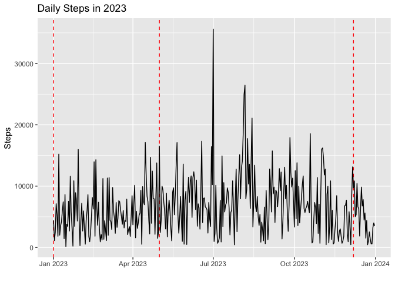<!-- -->

``` r
# 2022
ggplot(StepCount_2022, aes(date, StepCountDaily)) + 
  geom_vline(xintercept = as.numeric(holidays_2022), color = "red", linetype = "dashed", size = 0.5) +
  geom_line(color = "black") +
  labs(title = "Daily Steps in 2022", x = "", y = "Steps")
```

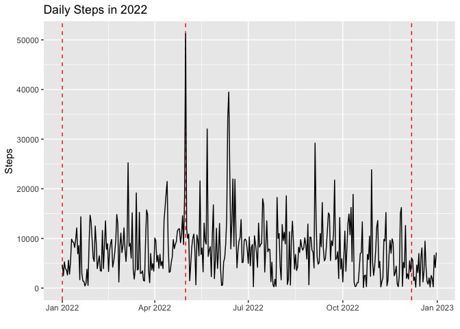<!-- -->

``` r
# 2021
ggplot(StepCount_2021, aes(date, StepCountDaily)) + 
  geom_vline(xintercept = as.numeric(holidays_2021), color = "red", linetype = "dashed", size = 0.5) +
  geom_line(color = "black") +
  labs(title = "Daily Steps in 2021", x = "", y = "Steps")
```

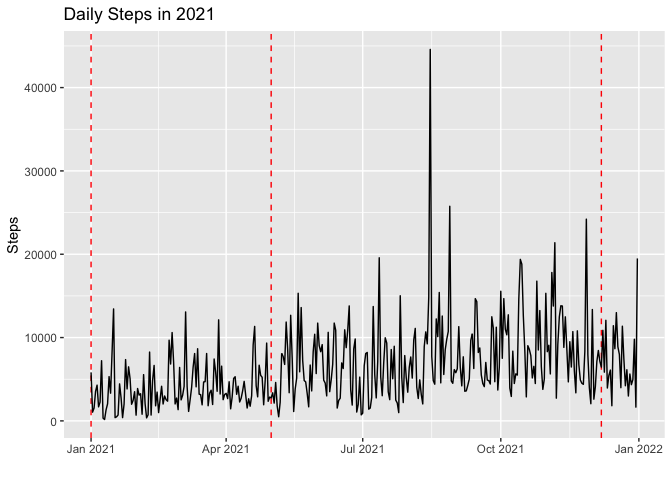<!-- -->

``` r
# 2020
ggplot(StepCount_2020, aes(date, StepCountDaily)) + 
  geom_vline(xintercept = as.numeric(holidays_2020), color = "red", linetype = "dashed", size = 0.5) +
  geom_line(color = "black") +
  labs(title = "Daily Steps in 2020", x = "", y = "Steps")
```

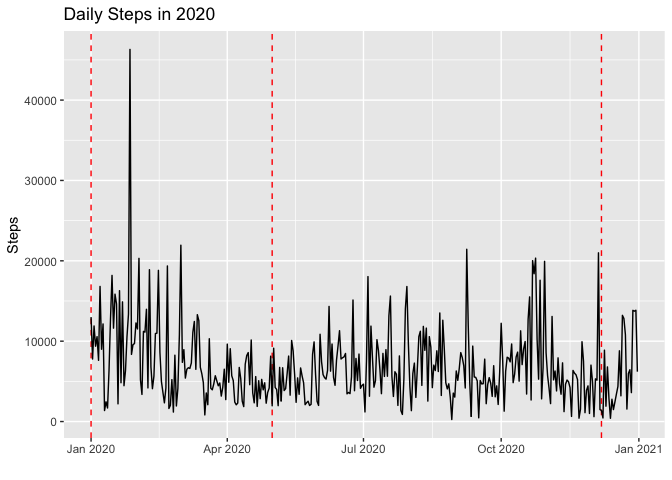<!-- -->

``` r
# 2019
ggplot(StepCount_2019, aes(date, StepCountDaily)) + 
  geom_vline(xintercept = as.numeric(holidays_2019), color = "red", linetype = "dashed", size = 0.5) +
  geom_line(color = "black") +
  labs(title = "Daily Steps in 2019", x = "", y = "Steps")
```

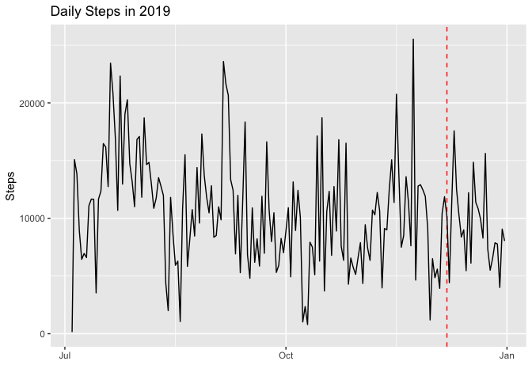<!-- -->

## Steps by day

In this plot I will present my averaged daily steps, ordered by day of
the week. I will use the data of all years first, then do the same but
order them by year.

``` r
# Preparing the data 
StepCount_by_day$day_name <- factor(StepCount_by_day$day_name, levels = c("Monday", "Tuesday", "Wednesday", "Thursday", "Friday", "Saturday", "Sunday"))

# Calculating the average by day 
avg_step_by_day_name <- StepCount_by_day %>%
  group_by(day_name) %>%
  summarise(avg_steps_d = mean(StepCountDaily), .groups = "drop")

# Calculating the overall average 
avg_step_overall <- mean(StepCount_by_day$StepCountDaily)

# Plotting the data 
ggplot(avg_step_by_day_name, aes(x = 0, xend = avg_steps_d, y = day_name, yend = day_name)) +
  
  geom_segment(color = "black") +  
  
  geom_point( aes(x = avg_steps_d,  y = day_name), size = 3, color = "black") + 
  
  geom_vline(xintercept = avg_step_overall, linetype = "dashed", color = "red") + 

  labs(x = "", y = "", title = "Average Steps by Day of the Week") +
  
  theme_classic() +
  
  theme(panel.grid = element_blank(), axis.ticks.y = element_blank()) +
  
  geom_text(aes(x = avg_steps_d, y = day_name, label = round(avg_steps_d, 1)), vjust = 1.7) + 
  
  scale_y_discrete(limits = rev(levels(StepCount_by_day$day_name))) 
```

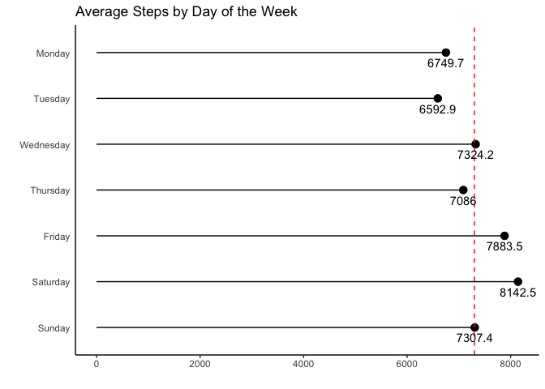<!-- -->

### Steps by day interpreted

It seems like I am more active during the weekends, especially on Friday
and Saturday, but rather laying low on Sundays. Every Wednesday, I have
a team meeting at my job, which has been rather consistent over the past
year or two, which explains the spike on Wednesdays. My bi-weekly Tennis
practice on Tuesdays and Thursdays should also bump up the activity on
those days. The lower activity on those two days, despite of my
practices has also an easy explanation - I don’t keep my phone in my
pocket during practice.

# Conclusion

In this brief data exploration, I looked at my step count only. It was
really interesting and fun to look deeper into my walking behavior and
make sense of patterns and data spikes. Correlating this data to what I
know about my own life is really fun.

Other really interesting data to correlate my step count to would be:

**Traveling data** (Or: do I walk more when I am on vacation? What type
of vacation? City and hiking trips might see more activity compared to
vacations at the beach )

**Financial data** (Or: do I walk less, when I reached the end of my
monthly budget?)

**Course Schedule** (Or: do I walk more when I have an intense
Schedule?)

Overall I really enjoyed doing this and have much more ideas for other
projects exploring the data set in the future. Also, I really start to
wonder what companies like Apple and Alphabet know about me, considering
they have access to this exact data, plus my location and other
interesting and just as sensitive data (which I am happy to share with
them for convenience of course).
